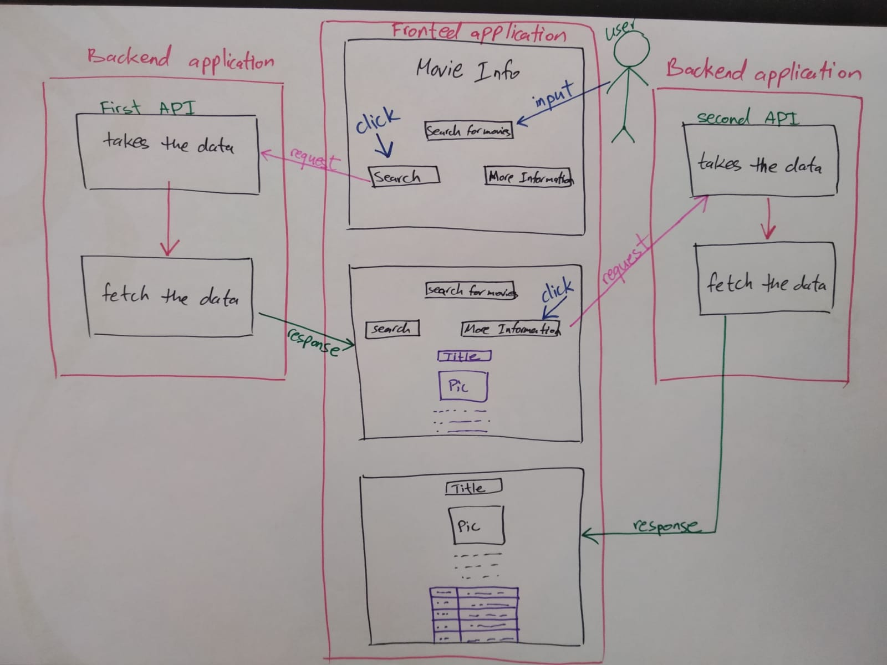

# Movies-info
A website to search for movie information.

# Movie-Info
https://lotus-1.github.io/SMS-P2/
 
###### Project week-2

# OUR TEAM:

##### Sahar Saker : https://github.com/saharsaker  
##### Nariman Pro : https://github.com/NaremanPro  
##### Sara Abu Zalaf : https://github.com/sara3112  

 

We built our application to let the user search for their favourite movies and TV-shows. The user can get information about the movie, like the release date, movie summary and rate. :cinema:

 
We used API, JAVASCRIPT, CSS, HTML5 technologies to build our app 

 
Some of the challenges we encountered are, finding the API key, finding the image URL and refactoring our code.

 
If we were going to continue working on this application, we would add a trailer to the movie, and more search options, like searching for actors.
